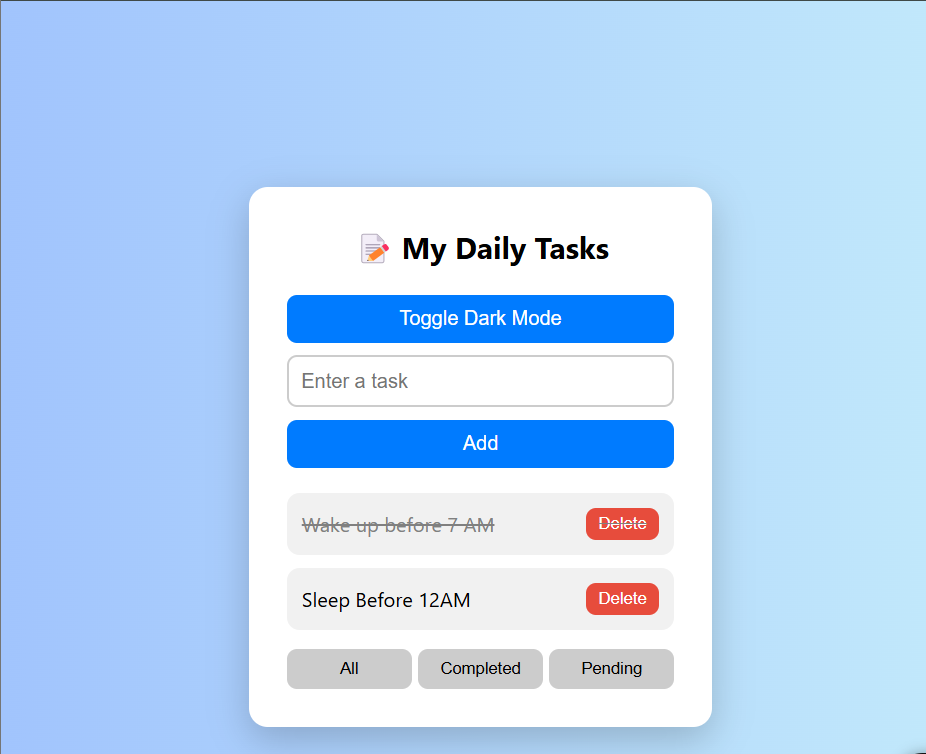

# 📝 Task Tracker

A user-friendly and minimalistic web app to manage daily tasks with ease.

🔗 **[Live Demo](https://arpita-priyadarshinee.github.io/task-tracker/)**

---

## ✨ Features

- ✅ Add, delete, and mark tasks as completed
- 🌗 Toggle between Dark and Light mode
- 🔍 Filter tasks (All, Completed, Pending)
- 💾 Auto-save tasks in LocalStorage
- 📱 Fully responsive (Mobile + Desktop)
- 🔔 Notifications for user actions

---

## 📂 Tech Stack

- HTML5
- CSS3
- JavaScript (Vanilla)
- LocalStorage API

---

## 🚀 Getting Started

1. Clone the repo:
git clone https://github.com/Arpita-priyadarshinee/task-tracker.git

2. Open `index.html` in any browser, or deploy using GitHub Pages.

---

## 🧠 Learning Outcome

- DOM Manipulation
- Event Handling
- Responsive UI Design
- Dark Mode Toggle
- Data Persistence using LocalStorage

---

## 📸 Screenshot

---

## 🙋‍♀️ Author

**Arpita Priyadarshinee**

- GitHub: [@Arpita-priyadarshinee](https://github.com/Arpita-priyadarshinee)
- Portfolio: _coming soon..._

---

## 📜 License

This project is open source and available under the [MIT License](LICENSE).
